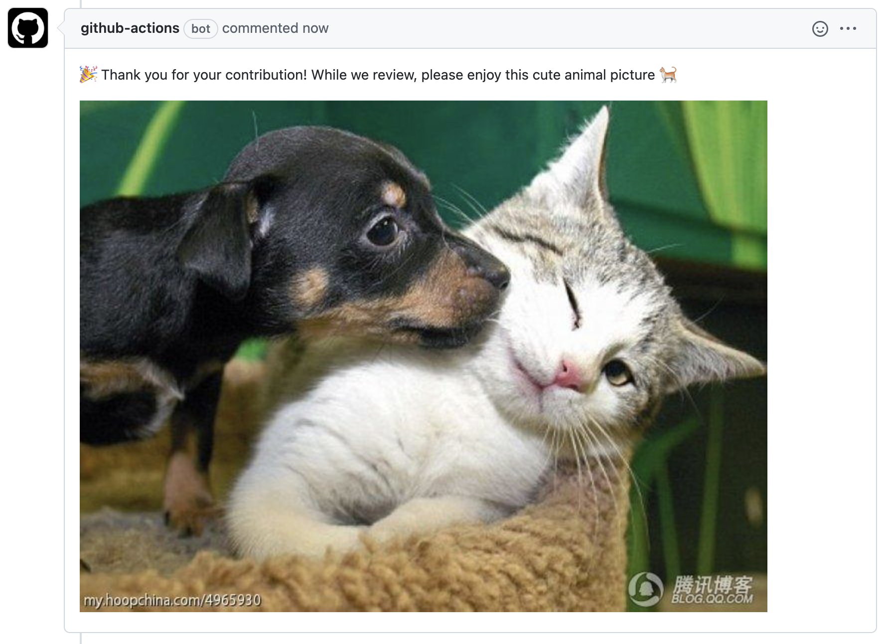

# animal-action


A github action to add smiles to pull requests



## Inputs

## `github_token`

**Required** A GitHub token

## `animals`

A comma-delimated string of types of animals pictures to comment with.

Default: `"cats,dogs,foxes"`.

## `pull_request_comment`

Comment to post along with animal picture.

Default: `':tada: Thank you for your contribution! While we review, please enjoy this cute animal picture'`.

## Outputs

None

## Example usage

```yaml
name: comment
on:
  pull_request:
    types: [opened]
jobs:
  comment:
    runs-on: ubuntu-latest
    steps:
      - uses: circa10a/animal-action@main
        with:
          github_token: ${{ secrets.GITHUB_TOKEN }}
          animals: 'cats,dogs' # cats,dogs,foxes currently supported
          pull_request_comment: ':tada: Thank you for the contribution! Here's a cute animal picture to say thank you!'
```
